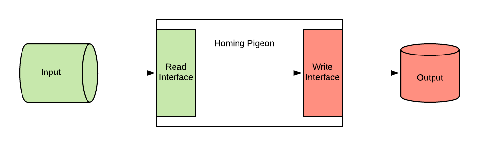

# Homing pigeon

Deliver messages from an input interface to an output interface.


[Credits](#acknowledgments)

### Overview



Homing Pigeon is an application thought to connect read and write adapters easily.
Whatever comes from an input, it will be sent to a specific output, without the need of writing the usual boilerplate code.
This tool is thought so that we can easily plug in any kind of adapter for both input and ouput.
We can use this application to easily store messages, or to easily proxy messages.
A few examples could be: AMQP to Elasticsearch, HTTP to MySQL, HTTP to HTTP, or any kind of combination.

An important detail, is that the message will be forwarded from the read interface to the write interface "as is", therefore the expected format would depend on which write adapter is connected.

### Currently implemented interfaces

#### Read interfaces

##### RabbitMQ

Reader interface reads messages from a single queue and acks or (optionally) nacks the message, depending
 as the writer will indicate. All nacks will be automatically dead lettered without retrying

#### Write interfaces

##### Elasticsearch with bulk API

Failed messages will be nacked, and successful messages will be acked.
It supports a well defined JSON format, which of course reminds of elasticsearch Bulk API:

```json
{
  "meta": { "index" : { "_index" : "test", "_id" : "1" } },
  "data": { "field1" : "value1" }
}
```
More info can be found at [elasticsearch's official doc](https://www.elastic.co/guide/en/elasticsearch/reference/current/docs-bulk.html)

### Example

We own `example.com`, and we decide to track multiple user events (user clicking on `example` button, user filling up our `example` form, etc)
We want to be able to graph those events quickly.
So we decide to deploy homing pigeon, linked to existing rabbitmq and elasticsearch clusters.
Once deployed, we can start sending messages to a well defined exchange (with a well defined format) from our website,
and automatically they will be persisted in elasticsearch. All we need todo now is deploy a kibana instance, and graph the data!

### Usage

Running the binary file will start up listen interface.

```bash
$ ./homing-pigeon
```

#### Docker

[Helm chart](https://github.com/softonic/homing-pigeon-chart) is available for easy deployment in k8s.

All release are available also through a [docker image](https://hub.docker.com/r/softonic/homing-pigeon).

#### Environment variables
In order to start up correctly, it needs well defined environment variables:

##### Core

| Name                                 | Value                                                                      |
| ------------------------------------ | -------------------------------------------------------------------------- |
| MESSAGE_BUFFER_LENGTH                | Buffer length for internal golang channel used for messaging               |
| ACK_BUFFER_LENGTH                    | Buffer length for internal golang channel used for acks                    |
| MIDDLEWARES_SOCKET                   | Socket to connect to middlewares. Ex: passthrough:///unix://tmp/test.sock" |

##### Read Adapters

###### RabbitMQ

| Name                                 | Value                                                              |
| ------------------------------------ | ------------------------------------------------------------------ |
| RABBITMQ_URL                         | RabbitMQ url string                                                |
| RABBITMQ_CA_PATH                     | Path to CA used to sign SSL cert for RabbitMQ server               |
| RABBITMQ_TLS_CLIENT_CERT             | Path to client certificate to connect to RabbitMQ server           |
| RABBITMQ_TLS_CLIENT_KEY              | Path to client key to connect to RabbitMQ server                   |
| RABBITMQ_DLX_NAME                    | RabbitMQ dead letters exchange name                                |
| RABBITMQ_DLX_QUEUE_NAME              | RabbitMQ dead letters exchange's queue name                        |
| RABBITMQ_EXCHANGE_NAME               | RabbitMQ messaging exchange name                                   |
| RABBITMQ_EXCHANGE_TYPE               | RabbitMQ messaging exchange type                                   |
| RABBITMQ_EXCHANGE_INTERNAL           | Whether RabbitMQ messaging exchange is internal                    |
| RABBITMQ_OUTER_EXCHANGE_NAME         | RabbitMQ outer exchange name                                       |
| RABBITMQ_OUTER_EXCHANGE_TYPE         | RabbitMQ outer exchange type                                       |
| RABBITMQ_OUTER_EXCHANGE_BINDING_KEY  | RabbitMQ binding key for external exchange                         |
| RABBITMQ_QUEUE_NAME                  | RabbitMQ messaging exchange's queue name                           |
| RABBITMQ_CONSUMER_NAME               | Name for RabbitMQ's consumer (optional, defaults to HOSTNAME)      |
| RABBITMQ_QOS_PREFETCH_COUNT          | RabbitMQ QoS prefetch count (defaults to 0)                        |

##### Write Adapters

###### Elasticsearch

####### Input format

At the moment only bulk operations are supported:
`{"meta":{"<operation>":{...}},"data":{<document>}}`

For more options see [Bulk API reference](https://www.elastic.co/guide/en/elasticsearch/reference/current/docs-bulk.html)

####### Configuration

| Name                                 | Value                                                              |
| ------------------------------------ | ------------------------------------------------------------------ |
| ELASTICSEARCH_URL                    | Elasticsearch url string                                           |
| ELASTICSEARCH_FLUSH_MAX_SIZE         | Elasticsearch flush to bulk API maximum size                       |
| ELASTICSEARCH_FLUSH_MAX_INTERVAL_MS  | Elasticsearch flush to bulk API max interval time, in milliseconds |


### Development

To run docker build:
```bash
$ make docker-build
```

To run the application:
```bash
$ docker compose up -d
```

To run tests:
```bash
$ make test
```

### Roadmap

* Implement interface for transforming messages after reader and before writer
* Add possibility to define username and password outside URLs for adapters


## Acknowledgments

A special thank you to [Adrià Compte](https://dribbble.com/muniatu), the genius behind the homing pigeon logo.
