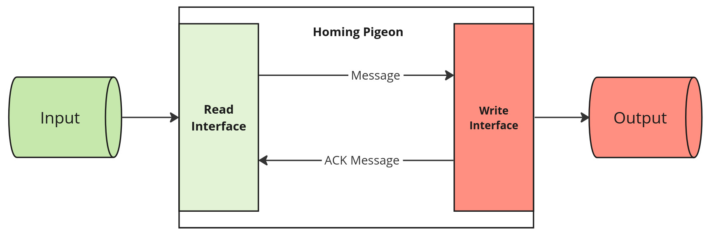

# Homing pigeon

Deliver messages from an input interface to an output interface.


[Credits](#acknowledgments)

### Overview



Homing Pigeon is an application thought to connect read and write adapters easily.
Whatever comes from an input, it will be sent to a specific output, without the need of writing the usual boilerplate code.
This tool is thought so that we can easily plug in any kind of adapter for both input and ouput.
We can use this application to easily store messages, or to easily proxy messages.
A few examples could be: AMQP to Elasticsearch, HTTP to MySQL, HTTP to HTTP, or any kind of combination.

An important detail, is that the message will be forwarded from the read interface to the write interface "as is", therefore the expected format would depend on which write adapter is connected.

### Message flow and ack/nack semantics

```
Reader ──> [request middlewares] ──> Writer ──> [response middlewares] ──> Reader (ack/nack)
```

Every message read from the input ends up **acked** or **nacked** back on the read adapter;
what each of those means (delete, dead letter, retry…) is the read adapter's decision, the
writer only reports the outcome per message.

Middlewares are external gRPC services chained between the reader and the writer (request
middlewares) and between the writer and the reader (response middlewares). They receive
batches of messages and can transform bodies and nack messages, but they can **not** ack a
message the writer nacked (there is no un-nack in the protocol) and they never see the
writer's backend response (e.g. the Elasticsearch bulk response). A failing middleware call
nacks the whole batch.

### Middlewares

```
  AMQP
   |
  Request ──> Middleware ──> Middleware ──> … ──> Middleware
   |
Elasticsearch
   |
  Response ──> Middleware ──> Middleware ──> … ──> Middleware
   |
  AMQP
```

There are two independent chains:

- **Request middlewares** run between the reader and the writer, and are the place to
  transform or enrich message bodies before they reach the write adapter.
- **Response middlewares** run between the writer and the reader, once each message already
  carries its `acked`/`nacked` outcome, and are the place to react to it (e.g. purge a cache
  for successfully written documents). At this point mutating the body has no effect on what
  was written.

#### How the chain works

Each middleware is a gRPC server implementing the `Middleware` service from
[`proto/middleware.proto`](proto/middleware.proto) (`Handle(Data) returns (Data)`), listening
on a Unix socket. Homing Pigeon only knows the **first** middleware of each chain
(`REQUEST_MIDDLEWARES_SOCKET` / `RESPONSE_MIDDLEWARES_SOCKET`); chaining is nested — each
middleware processes the batch, forwards it to the next one through its `OUT_SOCKET` (it
listens on `IN_SOCKET`), and returns the final result back up the chain.

Messages are sent in batches of up to `MIDDLEWARE_BATCH_SIZE`, waiting at most
`MIDDLEWARE_BATCH_TIMEOUT_MS` to fill one.

#### The contract

A middleware receives `Data.messages` (`Id`, `Body`, `acked`, `nacked`) and must answer with
the **same number of messages, with the same ids, in the same order**. It may:

- mutate `Body` (request chain);
- set `nacked: true` to reject a message.

It can **not** ack messages (`acked` in the response is ignored — only the writer acks), and
it can not un-nack a message. Any protocol violation — an error response, a length mismatch
or an id mismatch — nacks the **whole batch**. If the middleware is unreachable, the call
waits for it to become ready and retries on `UNAVAILABLE` (5 attempts with backoff) up to the
call timeout (31s by default); on expiry the batch is nacked.

#### Writing and deploying one

- **Go**: implement `proto.MiddlewareServer`; the
  [`pkg/middleware.UnimplementedMiddleware`](pkg/middleware/unimplemented.go) helper provides
  `Listen()` (socket setup) and `Next()` (forwarding to the next middleware). See
  [hp-pass-middleware](https://github.com/softonic/hp-pass-middleware) for a minimal
  passthrough example.
- **Any other language**: implement the service from `proto/middleware.proto` over a Unix
  socket, honoring the contract above.
- **Kubernetes**: the [Helm chart](https://github.com/softonic/homing-pigeon-chart) runs
  middlewares as sidecar containers (`requestMiddlewares` / `responseMiddlewares` values) and
  wires all the sockets automatically through a shared volume.

### Currently implemented interfaces

#### Read interfaces

##### RabbitMQ

Reads messages from a single queue and acks or nacks (`requeue=false`) each message as the
writer indicates. On startup it declares the exchanges, the queue (with
`x-dead-letter-exchange` pointing to `RABBITMQ_DLX_NAME`) and the dead letter
exchange/queue, so all nacked messages are dead lettered without retrying.

> Note: the dead letter **queue** is declared non-durable, so a large backlog lives in the
> broker's memory.

#### Write interfaces

##### Elasticsearch with bulk API

It supports a well defined JSON format, which of course reminds of elasticsearch Bulk API:

```json
{
  "meta": { "index" : { "_index" : "test", "_id" : "1" } },
  "data": { "field1" : "value1" }
}
```

More info can be found at [elasticsearch's official doc](https://www.elastic.co/guide/en/elasticsearch/reference/current/docs-bulk.html)

Per-message outcome:

| Situation                                                                                                                     | Outcome                             |
| ----------------------------------------------------------------------------------------------------------------------------- | ----------------------------------- |
| Bulk item answered with status <= 299                                                                                          | ack                                 |
| `delete` item answered with 404, `result: not_found` and no `error` object, with `ELASTICSEARCH_ACK_DELETE_NOT_FOUND=true`     | ack (idempotent delete, discarded)  |
| Any other bulk item with status > 299 (including 404s carrying an `error` object, e.g. `index_not_found_exception`)            | nack                                |
| Whole bulk request fails or answers an HTTP error status                                                                       | every message in the batch is nacked |
| Bulk response body cannot be decoded                                                                                            | remaining messages are nacked       |
| Message body is not valid JSON, or cannot be turned into a bulk line (e.g. missing `meta`)                                      | nack (never sent to Elasticsearch)  |

### Example

We own `example.com`, and we decide to track multiple user events (user clicking on `example` button, user filling up our `example` form, etc)
We want to be able to graph those events quickly.
So we decide to deploy homing pigeon, linked to existing rabbitmq and elasticsearch clusters.
Once deployed, we can start sending messages to a well defined exchange (with a well defined format) from our website,
and automatically they will be persisted in elasticsearch. All we need todo now is deploy a kibana instance, and graph the data!

### Usage

Running the binary file will start up listen interface.

```bash
./homing-pigeon
```

#### Docker

[Helm chart](https://github.com/softonic/homing-pigeon-chart) is available for easy deployment in k8s.

All release are available also through a [docker image](https://hub.docker.com/r/softonic/homing-pigeon).

#### Environment variables

In order to start up correctly, it needs well defined environment variables:

##### Core

| Name                          | Value                                                                                                |
|-------------------------------|------------------------------------------------------------------------------------------------------|
| MESSAGE_BUFFER_LENGTH         | Buffer length for internal golang channel used for messaging                                         |
| ACK_BUFFER_LENGTH             | Buffer length for internal golang channel used for acks                                              |
| REQUEST_MIDDLEWARES_SOCKET    | Socket to connect to middlewares between reader and writer. Ex: passthrough:///unix://tmp/test.sock" |
| RESPONSE_MIDDLEWARES_SOCKET   | Socket to connect to middlewares between writer and reader. Ex: passthrough:///unix://tmp/test.sock" |
| READ_ADAPTER                  | Read interface implementation. Default: AMQP                                                         |
| WRITE_ADAPTER                 | Write interface implementation. Default: ELASTIC                                                     |
| MIDDLEWARE_BATCH_SIZE         | Number of messages to send in batch to the middleware (Defaults to 50).                              |
| MIDDLEWARE_BATCH_TIMEOUT_MS   | Max time to wait until getting a full size batch in milliseconds (Defaults to 100ms).                |
| MIDDLEWARE_CALL_TIMEOUT_MS    | Max time to wait for a middleware call to complete, including waiting for the middleware to become reachable; on expiry the batch is nacked (Defaults to 31000ms). |

##### Read Adapters

###### RabbitMQ

| Name                                 | Value                                                              |
| ------------------------------------ | ------------------------------------------------------------------ |
| RABBITMQ_URL                         | RabbitMQ url string                                                |
| RABBITMQ_CA_PATH                     | Path to CA used to sign SSL cert for RabbitMQ server               |
| RABBITMQ_TLS_CLIENT_CERT             | Path to client certificate to connect to RabbitMQ server           |
| RABBITMQ_TLS_CLIENT_KEY              | Path to client key to connect to RabbitMQ server                   |
| RABBITMQ_DLX_NAME                    | RabbitMQ dead letters exchange name                                |
| RABBITMQ_DLX_QUEUE_NAME              | RabbitMQ dead letters exchange's queue name                        |
| RABBITMQ_EXCHANGE_NAME               | RabbitMQ messaging exchange name                                   |
| RABBITMQ_EXCHANGE_TYPE               | RabbitMQ messaging exchange type                                   |
| RABBITMQ_EXCHANGE_INTERNAL           | Whether RabbitMQ messaging exchange is internal                    |
| RABBITMQ_OUTER_EXCHANGE_NAME         | RabbitMQ outer exchange name                                       |
| RABBITMQ_OUTER_EXCHANGE_TYPE         | RabbitMQ outer exchange type                                       |
| RABBITMQ_OUTER_EXCHANGE_BINDING_KEY  | RabbitMQ binding key for external exchange                         |
| RABBITMQ_QUEUE_NAME                  | RabbitMQ messaging exchange's queue name                           |
| RABBITMQ_CONSUMER_NAME               | Name for RabbitMQ's consumer (optional, defaults to HOSTNAME)      |
| RABBITMQ_QOS_PREFETCH_COUNT          | RabbitMQ QoS prefetch count (defaults to 0)                        |

##### Write Adapters

###### Elasticsearch

####### Input format

At the moment only bulk operations are supported:
`{"meta":{"<operation>":{...}},"data":{<document>}}`

For more options see [Bulk API reference](https://www.elastic.co/guide/en/elasticsearch/reference/current/docs-bulk.html)

####### Configuration

| Name                                 | Value                                                              |
| ------------------------------------ | ------------------------------------------------------------------ |
| ELASTICSEARCH_URL                    | Elasticsearch url string                                           |
| ELASTICSEARCH_FLUSH_MAX_SIZE         | Elasticsearch flush to bulk API maximum size                       |
| ELASTICSEARCH_FLUSH_MAX_INTERVAL_MS  | Elasticsearch flush to bulk API max interval time, in milliseconds |
| ELASTICSEARCH_ACK_DELETE_NOT_FOUND   | When `true`, `delete` bulk items answered with `404`/`not_found` (no `error` object) are acked instead of nacked, since Elasticsearch treats deleting a missing document as an idempotent success. What a nack implies (e.g. dead lettering) remains up to the read adapter. Defaults to `false` |

### Development

To install the dev tools (`gotest`, `mockery`, `protoc-gen-go`) and download the module
dependencies (this does not modify `go.mod`/`go.sum` — library versions always come from the
committed files):

```bash
make dep
```

To run the application:

```bash
docker compose up -d
```

To run tests (plain `go test -race ./...` works too):

```bash
make test
```

To regenerate mocks (`make mock`) or the gRPC middleware protocol (`make generate-proto`,
requires `protoc`).

### Releasing

CI only builds, lints and tests — it does **not** publish images. Releases are manual:

1. Merge to master and tag it: `git tag vX.Y.Z && git push --tags`
2. Publish the multi-arch image (pushes `softonic/homing-pigeon:X.Y.Z` to Docker Hub, note
   the image tag has no `v` prefix):

   ```bash
   make docker-build TAG=X.Y.Z
   ```

3. If the deployment needs new configuration, update the
   [Helm chart](https://github.com/softonic/homing-pigeon-chart) (published to
   `charts.softonic.io` on merge to its master).

### Roadmap

* Implement interface for transforming messages after reader and before writer
* Add possibility to define username and password outside URLs for adapters

## Acknowledgments

A special thank you to [Adrià Compte](https://dribbble.com/muniatu), the genius behind the homing pigeon logo.
